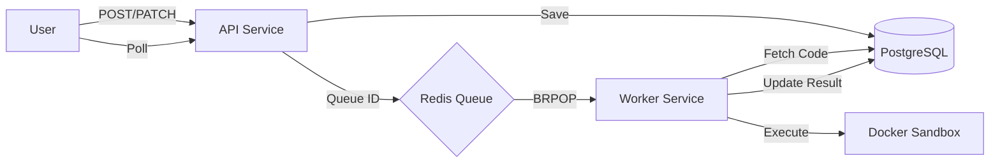

# Edtronaut – Live Code Execution Backend

A secure, reliable, and scalable backend system for executing user-submitted code in isolated environments.

## Architecture

The system follows a decoupled, asynchronous architecture using a background worker pattern to ensure API responsiveness and security.



### End-to-End Request Flow

1. **Session Creation**: User starts a session (`POST /code-sessions`).
2. **Autosave**: As the user types, the frontend calls (`PATCH /code-sessions/{id}`) to persist code snapshots in PostgreSQL.
3. **Execution Request**: User clicks "Run". The API service snapshots the current code into an `executions` record and pushes the `execution_id` to a Redis List.
4. **Background Processing**: A worker service pulls the ID from Redis, fetches the code from DB, and spins up a short-lived Docker container.
5. **Sandboxing**: The code runs with strict limits (CPU, Memory, Network: None).
6. **Result Retrieval**: The worker updates the DB with `stdout`, `stderr`, and `status`. The frontend polls the API for the final result.

## Quick Start

Ensure you have Docker and Docker Compose installed.

```bash
docker compose up --build
```

- **API Gateway**: `http://localhost:8080`
- **PostgreSQL**: `localhost:5432`
- **Redis**: `localhost:6379`

### Frontend Configuration

The frontend is now a modern Vite-based application located in the `frontend/` directory.

#### Local Development
1.  Navigate to `frontend/`.
2.  Install dependencies: `npm install`.
3.  Start development server: `npm run dev`.

#### Environment Setup
Update the API URL in `frontend/.env`:
```env
VITE_API_BASE_URL=http://localhost:8080
```

#### Production Build
To generate a production-ready bundle:
```bash
npm run build
```
The output will be in `frontend/dist/`.

## 🛠️ API Documentation

| Method  | Endpoint                  | Description                            |
| :------ | :------------------------ | :------------------------------------- |
| `POST`  | `/code-sessions`          | Initialize a new coding session.       |
| `PATCH` | `/code-sessions/{id}`     | Autosave code changes.                 |
| `POST`  | `/code-sessions/{id}/run` | Queue code execution.                  |
| `GET`   | `/executions/{id}`        | Poll for execution status and results. |

### Execution States

- `QUEUED`: Job is waiting in Redis.
- `RUNNING`: Worker has picked up the job and is starting the container.
- `COMPLETED`: Execution finished with exit code 0.
- `FAILED`: Compilation error, runtime error, or non-zero exit code.
- `TIMEOUT`: Execution exceeded the allocated time limit.

## Safety & Reliability

### Resource Constraints (Sandboxing)

- **Time Limit**: 10 seconds per execution.
- **Memory Limit**: 256MB per container.
- **CPU Limit**: 0.5 CPU shares.
- **Network**: Completely disabled (`--network none`) to prevent data exfiltration.
- **Process Limit**: Max 64 PIDs to prevent fork bombs.
- **Disk I/O**: Limited workspace size and immediate cleanup.

### Reliability

- **Rate Limiting**: Users are limited to one execution per 5 seconds per session to prevent abuse.
- **Infrastructure Retries**: The worker service automatically retries jobs if an infrastructure failure occurs (e.g., Docker daemon temporarily unavailable). _User code failures are not retried._
- **Workspace Cleanup**: Temporary directories are deleted immediately after execution, regardless of success or failure.

## Design Decisions & Trade-offs

1. **Redis for Queuing**: Chosen for its high performance and native support for reliable queues (`LPUSH`/`BRPOP`). It acts as a shock absorber during traffic spikes.
2. **PostgreSQL as Source of Truth**: Used to store both current session state and historical execution records. This ensures that even if a worker crashes, the execution metadata is preserved.
3. **Stateless API**: The `api-service` carries no state, allowing it to scale horizontally behind a load balancer.
4. **Worker Decoupling**: Worker services can be scaled independently of the API. In a production environment, workers could even run on different clusters for better isolation.
5. **Trade-off: Poll vs. WebSockets**: I chose polling for result retrieval to keep the architecture simple and robust. For a real-time production app, WebSockets (via a dedicated service) would be a better choice for UX but adds complexity.

## Future Improvements (Production Readiness)

1. **Authentication**: Implement JWT-based auth to secure sessions.
2. **Prometheus Metrics**: Add monitoring for queue size, worker latency, and failure rates.
3. **Advanced Sandboxing**: Transition from Docker to gVisor or Firecracker VMs for stronger multi-tenant isolation.
4. **Caching Results**: Cache results for identical code snippets to save compute resources.
5. **Dynamic Language Support**: Use a plugin system or dedicated images for more complex environments (e.g., installing specific libraries).
6. **K8s Integration**: Deploy workers as K8s Jobs for better resource management and autoscaling.
